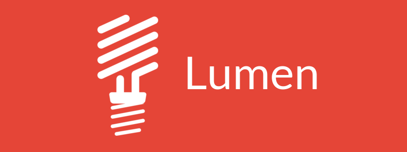

# :gear: university-market-api
Projeto da **camada de back-end** da aplicação University Market.

## Conteúdo

* [Sobre](#about)
* [Requisitos](#requirements)
* [Instalação](#installation)
* [Tecnologias](#technologies)

<div id='about'/> &nbsp;

## :pushpin: Sobre

Este repositório refere-se à camada de **back-end** do projeto University Market.<br>
Leia mais sobre este projeto no [repositório de apresentação](https://github.com/university-market/university-market).

<div id='requirements'/> &nbsp;

## :pushpin: Requisitos

>*Estes requisitos são direcionados aos desenvolvedores do projeto*

- [x] [Composer](https://getcomposer.org/) - gerenciador de pacotes utilizado pelas plataformas PHP
- [x] [PHP](https://www.php.net/downloads) instalado (versão >= 7.3)
- [x] Banco de dados MySql - banco de dados relacional utilizado pela aplicação
  - [Configurando MySql no seu computador](https://www.devmedia.com.br/mysql-tutorial/33309)
  - [Configurando conexão MySql no Linux](#) - ainda não disponível
  - [SGBD MySql Workbench](https://dev.mysql.com/downloads/workbench/) - recomendado para Windows
  - [DBeaver](https://dbeaver.io/) - multi-plataforma
- [x] Driver adequado para conexão com o banco de dados (driver MySql para PHP)
- [x] Servidor Apache para executar a API em ambiente local
- [x] Simulador de requisições HTTP de API's REST:
  - [Postman](https://www.postman.com/downloads/)
  - [Insomnia](https://insomnia.rest/download)
- [x] IDE / Editor de texto - recomenda-se o [Visual Studio Code](https://code.visualstudio.com/)
  
> No caso da utilização do VSCode, recomenda-se a utilização das seguintes extensões:
> * Laravel Snippets
> * Lumen Smart Command
> * GitLens

<div id='installation'/> &nbsp;

## :pushpin: Instalação

>*Observe atentamente os [requisitos](#requirements) necessários para poder executar, em modo de desenvolvedor, a aplicação no seu computador*

* Clone este projeto
  ```bash
  git clone https://github.com/university-market/university-market-api.git
  ```
* Defina as variáveis de ambiente do projeto de acordo com o exemplo
  - Exemplo em `application.env.example`
* Dentro do repositório clonado do projeto, abra um terminal/cmd e siga as seguintes instruções:

:one: Entre na raíz da aplicação
```bash
cd application
```
:two: Instale as dependências do projeto
```bash
composer update
```
:three: Execute o projeto em uma porta disponível no seu computador (default: `80`/recomendado: `8080`)
```bash
php -S localhost:8080 -t public
```
:asterisk: Se o comando `php` não funcionar, veja [como configurar o PHP em variáveis de ambiente](https://pt.stackoverflow.com/questions/183571/como-configurar-um-ambiente-de-desenvolvimento-manualmente) (Windows).

<div id='technologies'/> &nbsp;

## :pushpin: Tecnologias

Esta camada de back-end é desenvolvida sobre as seguintes tecnologias:



- [x] Micro-framework Lumen - baseado no framework Laravel
- [x] PHP - linguagem utilizada pelo framework
- [x] Eloquent - ORM utilizado pelo framework
- [x] MySql - Banco de dados
- [x] API REST - Arquitetura de desenvolvimento da aplicação
